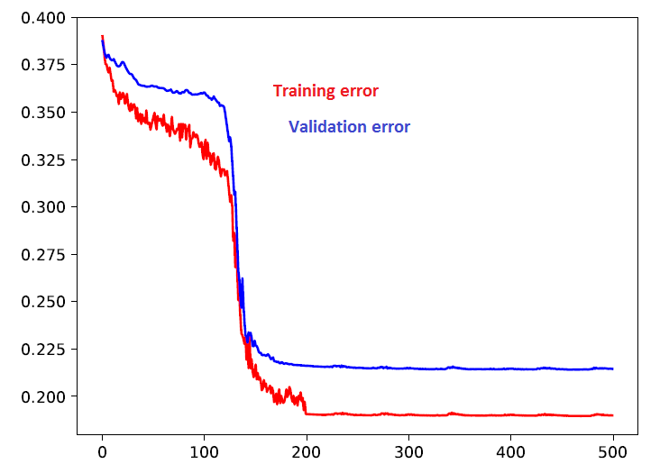

## Introduction

This is implementation of neural Turing machine (NTM) introduced in [Neural Turing Machines]https://arxiv.org/abs/1410.5401 paper. Below is dataflow diagram of NTM with one write-read head. 

## Implementation architecture

Think of it as 3 layer (software) architecture:

**functions** - In *chain_functions* directory. Functions described in NTM paper.

**heads** - Classes in *ntm_heads.py* . Head perform actions in this order WRITE, MOVE, READ. Superposition of the head is given by weighting vector which is stored and manipulated by head-object.

**wrapper** - In *ntm_wrapper.py* . Wrapper contains controller, heads and the memory. Wrapper takes controller output and distributes it to its heads. Heads then manipulate with the memory. Finally wrapper sends readouts from read-heads back to controller.  

## How to

Basically, the wrapper behaves like any layer. You just have to specify: size of memory, size of memory cell, which heads to use and their maximal shift. Also you have to specify its controller, which is just a neural network with a right input/output size. It is worth mentioning that the memory size can be changed during run. 

See *main.py* for details.

## Results

So far I performed experiments, with one writeread-head controlled by simple forward controller, on copy task. Memory sizes were 10x5. The network was trained on 500 epochs, each epoch it was fed with 200 sequences of random size ranging from 1 to 10. See the picture below for the result example. Controller seems to shift the head from down to up. When the input sequence ends, the controller jumps with the head on the beginning and then goes up again.

## Future

* implement and experiment with various wrappers (multiple heads, one memory; multiple memories with one head etc..)
* implement other tasks
